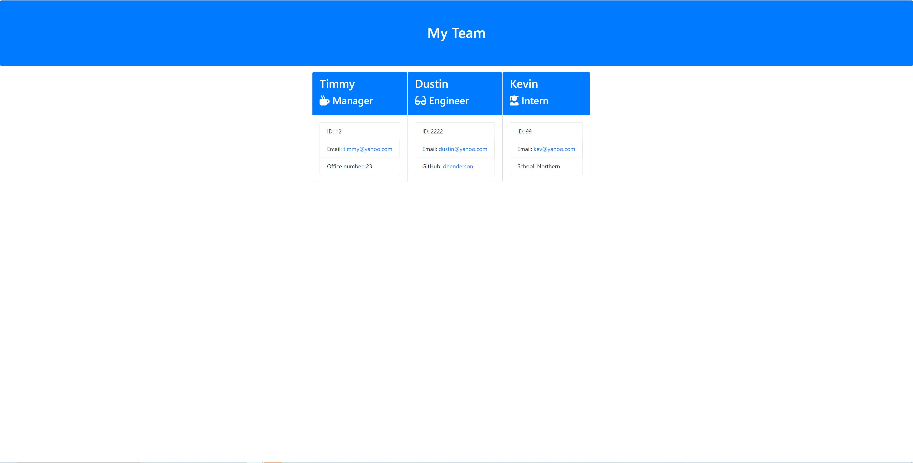

# TB Team Profile Generator

## Description
This app is used to create a visual representation of a team of users and some of their information
   
## Table of Contents:
  - [Description](#description)
  - [Screenshot](#screenshot)
  - [Demo](#demo)
  - [Deployment](#deployment)
  - [Installation](#installation)
  - [License](#license)
  - [Built With](#built-with)
  - [Tests](#tests)
  - [Questions](#questions)

## Screenshot

## Demo
A demo of the application can be found here: https://watch.screencastify.com/v/Rlrj8euQrf2srfvXICx0

## Deployment
This application is deployed at: https://github.com/1tbrooks1/tb-team-profile-generator

## Installation
An IDE (ex: VS Code), Node.js

## License
This project is covered under the MIT license.

## Built With
* HTML
* JavaScript
* Bootstrap
* Node.js

## Tests
Clone the repo and then you can either run npm test or node index.js in the terminal

## Questions
If you have any questions in regards to this project 

You can contact me on GitHub at: https://github.com/1tbrooks1 

You can also 📧 email me at: tbrooks321@yahoo.com for any other questions